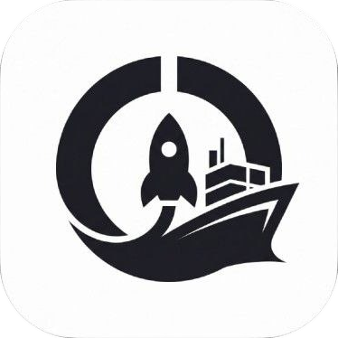
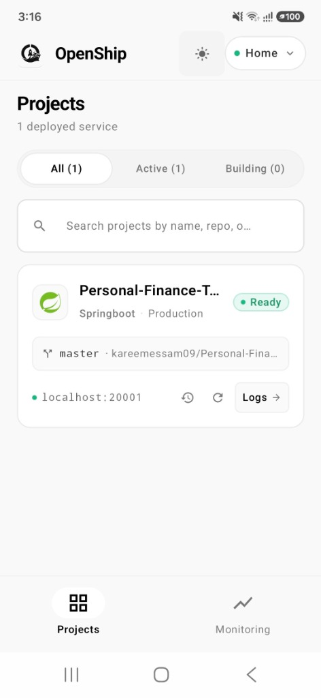
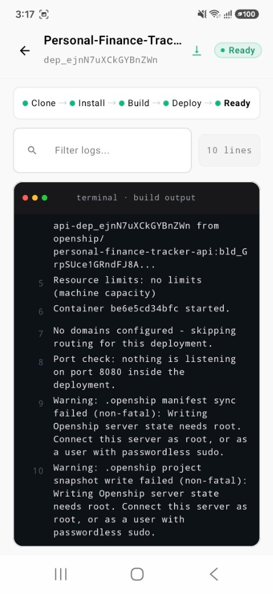
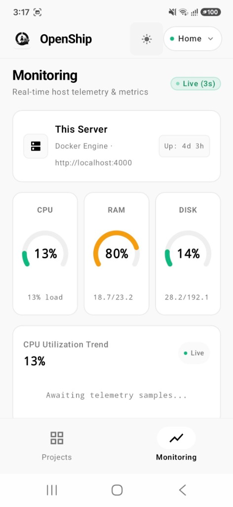
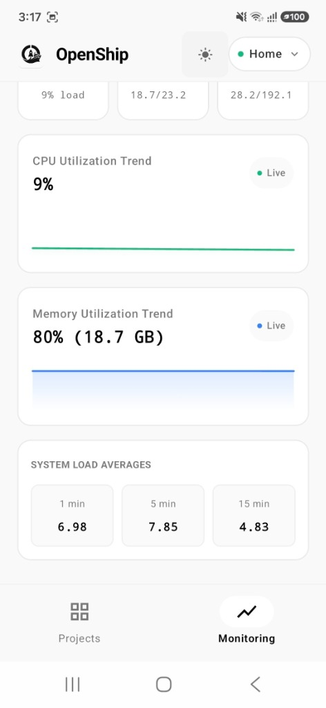
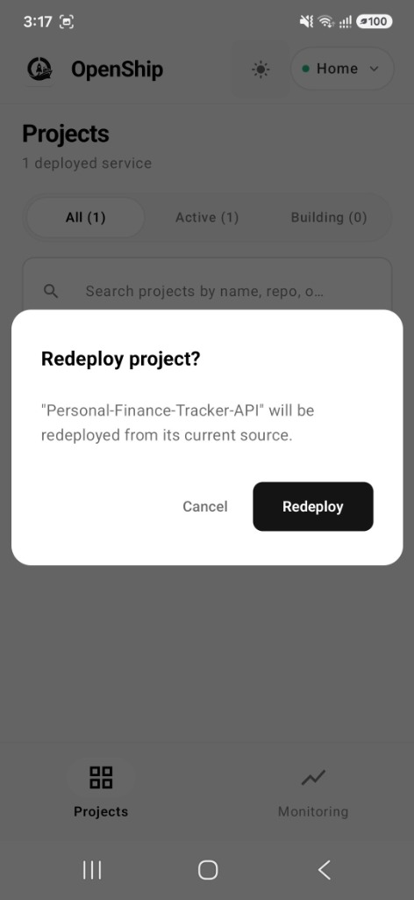

<p align="center">
  
</p>

<h1 align="center">Openship Mobile</h1>

<p align="center">
  <strong>Unofficial mobile client for <a href="https://github.com/oblien/openship">Openship</a> — the open-source, self-hostable deployment platform. Android today, iOS next — one Kotlin Multiplatform codebase.</strong>
</p>

<p align="center">
  <a href="LICENSE"></a>
  <a href="https://kotlinlang.org/"></a>
  <a href="https://developer.android.com/"></a>
</p>

> **Note**: This is an **unofficial community client**. Built against the public HTTP API, SSE streams, and MCP endpoint. Compatible with self-hosted Openship and Openship Cloud.

<details>
<summary><b>Screenshots & UI Showcase (click to expand)</b></summary>
<br/>

| Projects Dashboard | Deploy Logs | Server Monitoring |
|:---:|:---:|:---:|
|  |  |  |

| Telemetry Trends | Redeploy Confirmation |
|:---:|:---:|
|  |  |

</details>

---

## Features

| Area | What you get |
|---|---|
| **Connect** | Add an Openship instance by URL + Personal Access Token (PAT). Multi-instance switcher. Tokens in EncryptedSharedPreferences (Android Keystore). |
| **Projects** | Project list with deployment status, matching the web dashboard language. |
| **Live deploy logs** | SSE stream with base64 decode, ANSI colors, stage stepper, resume via `?since=`. |
| **Server monitor** | Live CPU / RAM / disk / load (self-hosted; hidden in cloud mode). |
| **Redeploy & rollback** | MCP-backed write actions with confirmation; degrades to read-only if MCP/tools unavailable. |
| **Theme** | Dark / light, aligned with Openship dashboard tokens. |

**Platform today:** Android (minSdk 24). This is a **Kotlin Multiplatform** project — all networking, models, ViewModels, and UI live in the shared `:shared` module; only platform plumbing (keystore, OkHttp engine) is Android-specific. **iOS is an upcoming phase**: the architecture already preserves it, and adding an `iosMain` target requires no rewrite of the shared code.

## Requirements

- JDK 21+
- Android Studio (recent stable) with Kotlin Multiplatform support
- Android SDK (compileSdk / targetSdk 36)
- A running [Openship](https://github.com/oblien/openship) instance and a PAT (`opsh_pat_…`)

## Quick start

```bash
git clone https://github.com/kareemessam09/Openship-App.git
cd Openship-App
./gradlew :androidApp:assembleDebug
./gradlew :androidApp:installDebug   # device or emulator
```

### Point the app at Openship

1. Run Openship (`bun install && bun dev` in the Openship repo). API default: `http://localhost:4000`.
2. Create a PAT in the dashboard: **Settings → API Tokens**.
3. In the app:
   - **Emulator:** `http://10.0.2.2:4000` (host loopback)
   - **USB device:** app install runs `adb reverse` for ports `4000` / `20000`, or use your LAN IP
   - **Sideloaded APKs** (installed outside Gradle) don't get this: run `adb reverse tcp:4000 tcp:4000` manually, or use `http://<lan-ip>:4000`. Reverse rules are also cleared whenever USB reconnects.
   - **Wi‑Fi device:** `http://<your-machine-lan-ip>:4000`

Cleartext HTTP is allowed for local/LAN self-hosting via `network_security_config.xml`. Prefer HTTPS for anything beyond your network.

### Build & test

```bash
./gradlew :androidApp:assembleDebug
./gradlew :shared:allTests
./gradlew :androidApp:testDebugUnitTest
```

### Release APKs (per ABI)

Release builds use **R8 minify + resource shrink** and **ABI splits** (no fat universal APK).

```bash
./gradlew :androidApp:assembleRelease
# outputs: androidApp/build/outputs/apk/release/androidApp-<abi>-release-*.apk
# typical size: ~5 MB each (vs ~26 MB unminified debug)
```

| ABI | Devices |
|---|---|
| `arm64-v8a` | Most phones (default download) |
| `armeabi-v7a` | Older 32-bit ARM |
| `x86` / `x86_64` | Emulators |

Optional signing (otherwise APKs are unsigned — fine for local install with `adb install -r` after `zipalign`/`apksigner`, or set):

```bash
# env or signing.properties (gitignored)
OPENSHIP_STORE_FILE=/path/to/upload.jks
OPENSHIP_STORE_PASSWORD=...
OPENSHIP_KEY_ALIAS=...
OPENSHIP_KEY_PASSWORD=...
```

### CI Releases

Pushing a tag (`v*`, e.g. `v0.2.0` — must match `versionName`) triggers [.github/workflows/release.yml](.github/workflows/release.yml): runs unit tests, builds the per-ABI release APKs, and publishes a GitHub Release with them plus the R8 `mapping.txt`.

For signed releases, add these repo secrets: `ANDROID_KEYSTORE_BASE64` (base64 of your keystore), `OPENSHIP_STORE_PASSWORD`, `OPENSHIP_KEY_ALIAS`, `OPENSHIP_KEY_PASSWORD`. Without secrets the workflow still publishes unsigned APKs.

Play Store: prefer `./gradlew :androidApp:bundleRelease` (AAB); ABI/language/density splits stay enabled in the bundle.

## Stack

| Piece | Choice |
|---|---|
| Language / UI | Kotlin 2.4, Compose Multiplatform 1.11 |
| Modules | `:androidApp` host + `:shared` KMP library |
| HTTP / SSE | Ktor 3.5 (OkHttp on Android) |
| Actions | [Kotlin MCP SDK](https://github.com/modelcontextprotocol/kotlin-sdk) client → `/api/mcp` |
| DI | Koin 4 |
| Secrets | AndroidX Security Crypto |

## Architecture (short)

```
androidApp/     → Application, Activity, Android Koin wiring
shared/
  commonMain/   → REST + SSE + MCP, models, ViewModels, Compose UI
  androidMain/  → OkHttp engine, EncryptedSharedPreferences
```

- **REST + SSE** for discovery, projects, live logs, monitoring  
- **MCP** for curated write actions (redeploy, rollback) with runtime tool discovery  
- One shared `HttpClient`; PAT only in `Authorization` headers (no query-string tokens)

Deeper notes for contributors and agents: [CONTRIBUTING.md](CONTRIBUTING.md), [AGENTS.md](AGENTS.md), [CONTEXT.md](CONTEXT.md).

## Status & roadmap

| Phase | Scope | Status |
|---|---|---|
| **v0.1** | Connect, projects, live logs, monitor | Done |
| **v0.2** | MCP foundation, deployment history, redeploy, rollback | Done |
| Next | Service controls, env vars, domains (deferred until write paths stay safe) | Planned |
| Upcoming phase | **iOS target** — same shared KMP code, new `iosMain` platform layer | Planned |
| Later | Push notifications, broader MCP surface | Planned |

API shapes can change with Openship releases. The client uses tolerant JSON (`ignoreUnknownKeys`) and runtime MCP tool discovery; still, pin/test against the Openship version you run.

## Relationship to Openship

This repository is an **unofficial community client**. It is intended for people who want a mobile companion to self-hosted Openship.

If you maintain or contribute to [oblien/openship](https://github.com/oblien/openship):

- Happy to align naming, branding, and API usage with upstream guidance
- Open to listing under community clients, a monorepo `apps/mobile`, or transfer under the org if that ever makes sense
- Issues and PRs that improve API stability for third-party clients are very welcome upstream

**Trademark / branding:** “Openship” refers to the upstream project. This app is not an official product. Do not present it as endorsed unless Openship maintainers say so.

## Security

- PATs stay on-device (Keystore-backed prefs). No middleman backend.
- Grant PATs least privilege (`project:list`, `deployment:read`, `server:read`, plus write scopes only if you use redeploy/rollback).
- Do not commit `local.properties`, `.env`, keystores, or real PATs.
- Report security issues privately if possible (see [SECURITY.md](SECURITY.md)).

## Contributing

See [CONTRIBUTING.md](CONTRIBUTING.md). Short version: JDK 21, build with Gradle, conventional commits, keep networking in `shared/commonMain`.

## License

[Apache License 2.0](LICENSE) — same family as Openship and the Kotlin MCP SDK.

```
Copyright 2026 the Openship-App contributors
```

## Links

- Openship: https://github.com/oblien/openship  
- Kotlin MCP SDK: https://github.com/modelcontextprotocol/kotlin-sdk  
- Compose Multiplatform: https://www.jetbrains.com/compose-multiplatform/
